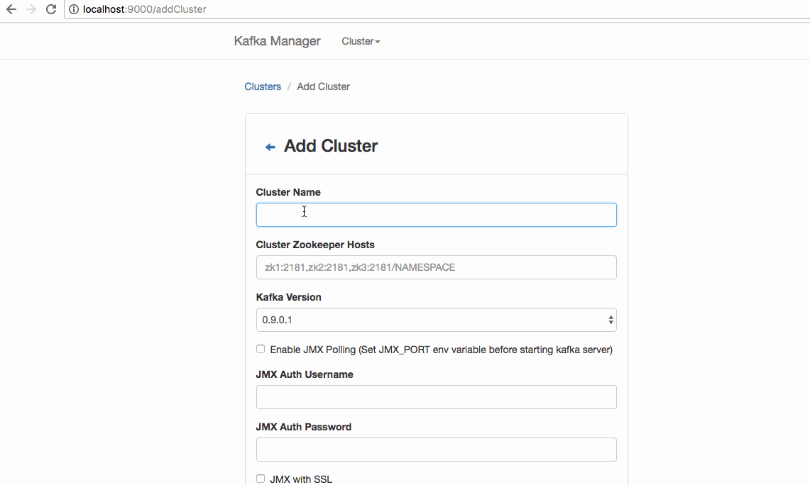

# KSQL
Stack to push docker events into kafka and use the KSQL stream processor to join the different events.

## Start the Stack

```
$ docker stack deploy -c docker-compose.yml ksql
Creating service ksql_engine
Creating service ksql_kafkacat
Creating service ksql_zookeeper
Creating service ksql_broker
Creating service ksql_manager
Creating service ksql_qframe
```

After a couple of seconds (when all image are downloaded and started), open [http://localhost:9000](http://localhost:9092) to get an insight into kafka using the kafka-manager.



### Producer

To feed the KSQL processor a qframe agent is put in place, subscribing to the docker events' API and publishing the events to the topic `cnt_event`.
A starting container will publish the container information to `cnt_detail`.

**ToDo**:

- [ ] The agent should totally normalize the information (swarm node, services, etc.) so the KSQL can JOIN the information again.
- [ ] Drop the health-check events? Or maybe not to be able to alert on missing health-checks.

### Consumer

In order to see the events going through kafka, `kafkacat` can be used.

```
$  docker exec -ti $(docker ps -qf label=com.docker.swarm.service.name=ksql_kafkacat) kafkacat -q -b tasks.broker:9092 -t cnt_event -c 1
{"event_action":"start","event_container_id":"","event_scope":"","event_type":"container","msg_base_version":"0.1.8","msg_id":"","msg_message":"container.start","msg_source_id":"0","msg_source_path":"docker-events","msg_source_success":"true","msg_tags":"","msg_time":"2017-10-05 14:41:01 +0000 UTC","msg_time_unix_nano":"1507214461000000000"}
```
### KSQL

**TBD** The ksql query has to be crafted a little bit, so that it matches the topics JSON schema.

```
$ docker exec -ti $(docker ps -qf label=com.docker.swarm.service.name=ksql_engine) bash
bash-4.3# cd /opt/ksql/bin
bash-4.3# ./ksql-cli remote http://localhost:9098
ksql> CREATE STREAM data (data VARCHAR) WITH (VALUE_FORMAT = 'JSON', KAFKA_TOPIC = 'input');

 Message
----------------
 Stream created
ksql> SHOW STREAMS;

 Stream Name | Kafka Topic | Format
------------------------------------
 DATA        | input       | JSON
ksql> SELECT * FROM data;
1507107288461 | null | test3
```
