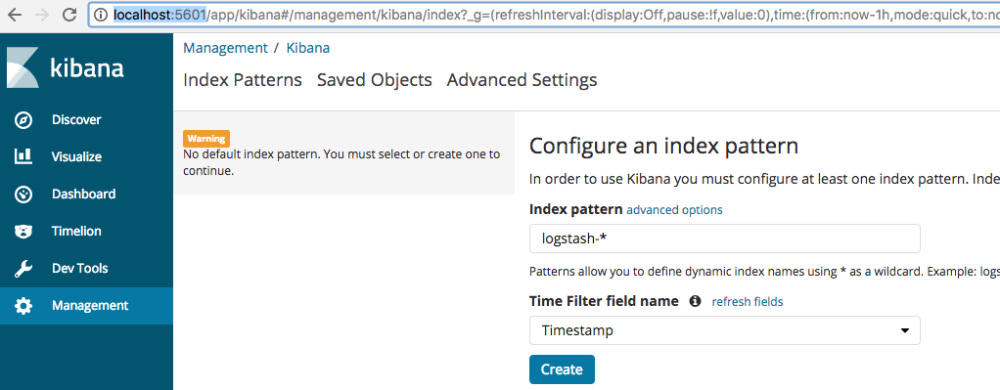

# qframe Log Stack

This stack will spin up a log (and metrics) stack which is filled by a qframe agent.

## Ship It

```bash
$ docker swarm init
Swarm initialized: current node (6qk5edkav33ozx5wdnn62qn7b) is now a manager.
$ docker stack deploy -c docker-compose.yml qframe
Creating network qframe_default
Creating service qframe_frontend
Creating service qframe_elasticsearch
Creating service qframe_kibana
Creating service qframe_qframe-logs
Creating service qframe_influxdb
Creating service qframe_chronograf
Creating service qframe_www
```

As all images has to be downloaded, get yourself a coup of tea... :)

```bash
$ watch docker service ls
ID                  NAME                   MODE                REPLICAS            IMAGE                            PORTS
xfxwuqhj05g1        qframe_chronograf      replicated          1/1                 qnib/plain-chronograf:0.1.3.7    *:8888->8888/tcp
szq9ncljg2dk        qframe_elasticsearch   replicated          0/1                 qnib/plain-elasticsearch:6.0.1   *:9200->9200/tcp,*:9300->9300/tcp
qc6s53bxuykp        qframe_frontend        replicated          0/1                 qnib/plain-grafana4:4.6.2-6      *:3000->3000/tcp
n0e5d5ckid4h        qframe_influxdb        replicated          0/1                 qnib/plain-influxdb:1.3.7        *:2003->2003/tcp,*:4242->4242/tcp,*:8086->8086/tcp
cwwav1o4tqj9        qframe_kibana          replicated          0/1                 qnib/plain-kibana:6.0.1          *:5601->5601/tcp
rtiu1j6h59eb        qframe_qframe-logs     replicated          0/1                 qnib/qframe-logs:5ac7cfb14efa
k5gxs395amru        qframe_www             replicated          0/1                 nginx:latest                     *:8080->80/tcp
```

After some time it will look like that:

```
$ docker service ls
ID                  NAME                   MODE                REPLICAS            IMAGE                            PORTS
xfxwuqhj05g1        qframe_chronograf      replicated          1/1                 qnib/plain-chronograf:0.1.3.7    *:8888->8888/tcp
szq9ncljg2dk        qframe_elasticsearch   replicated          1/1                 qnib/plain-elasticsearch:6.0.1   *:9200->9200/tcp,*:9300->9300/tcp
qc6s53bxuykp        qframe_frontend        replicated          1/1                 qnib/plain-grafana4:4.6.2-6      *:3000->3000/tcp
n0e5d5ckid4h        qframe_influxdb        replicated          1/1                 qnib/plain-influxdb:1.3.7        *:2003->2003/tcp,*:4242->4242/tcp,*:8086->8086/tcp
cwwav1o4tqj9        qframe_kibana          replicated          1/1                 qnib/plain-kibana:6.0.1          *:5601->5601/tcp
rtiu1j6h59eb        qframe_qframe-logs     replicated          1/1                 qnib/qframe-logs:5ac7cfb14efa
k5gxs395amru        qframe_www             replicated          1/1                 nginx:latest                     *:8080->80/tcp
```

## Trigger Log

As all stack containers do not opt-in to the logging agent, logs have to be triggered on the `nginx` container.

```
$ curl -sI http://localhost:8080
HTTP/1.1 200 OK
Server: nginx/1.13.7
Date: Fri, 08 Dec 2017 11:53:03 GMT
Content-Type: text/html
Content-Length: 612
Last-Modified: Tue, 21 Nov 2017 14:28:04 GMT
Connection: keep-alive
ETag: "5a1437f4-264"
Accept-Ranges: bytes
```

## Open Dashboards

### Kibana

Kibana is available under [http://localhost:5601](http://localhost:5601) and will great the user with a index setup.



Please click create and browse the logs under `Discover`.

### Grafana

The metrics dashboard Grafana does not need a setup and can be found under [http://localhost:3000](http://localhost:3000/dashboard/db/qframe-stats?orgId=1&from=now-15m&to=now).
`qframe-stats` will provide a dashboard using (agent-internal) metrics and annotations.
