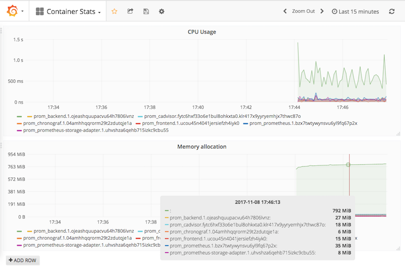

# Prometheus backed Metrics stack

This stack spins up
 - **InfluxDB** as metrics backend
 - **chronograf** as a InfluxDB WebUI
 - **prometheus** to scrape metrics information from the docker-engine and generic container information
 - **Grafana4** as frontend
 - **cAdvisor** to sample container metrics for Prometheus to fetch
 - The **node-exporter** will provide metrics from the underlying node
 - **prometheus-remote-storage** in order to use InfluxDB as a persistant storage.


### Deploy the stack

```bash
$ docker stack deploy -c docker-compose.yml prom
Creating network prom_default
Creating service prom_backend
Creating service prom_chronograf
Creating service prom_frontend
Creating service prom_cadvisor
Creating service prom_prometheus
Creating service prom_prometheus-storage-adapter
$ sleep 30 ; docker service ls
ID                  NAME                              MODE                REPLICAS            IMAGE                                         PORTS
pdhpbfhjytom        prom_backend                      replicated          1/1                 qnib/plain-influxdb:1.3.7                     *:2003->2003/tcp,*:4242->4242/tcp,*:8086->8086/tcp
q3reixz5rt8i        prom_cadvisor                     global              1/1                 google/cadvisor:latest
2ajlayyb43ya        prom_chronograf                   replicated          1/1                 qnib/plain-chronograf:0.1.3.7                 *:8888->8888/tcp
wx2tloye20fp        prom_frontend                     replicated          1/1                 qnib/plain-grafana4:4.6.1-4                    *:3000->3000/tcp
byy694a9k479        prom_prometheus                   replicated          1/1                 qnib/plain-prometheus:latest                  *:9090->9090/tcp
vn3u0g9mcl1y        prom_prometheus-storage-adapter   replicated          1/1                 qnib/plain-prometheus-remote-storage:latest
```

## WebUIs

Grafana can be found under [localhost:300](http//localhost:3000) (admin/admin) providing multiple dashboards:

- **cadvisor** 
