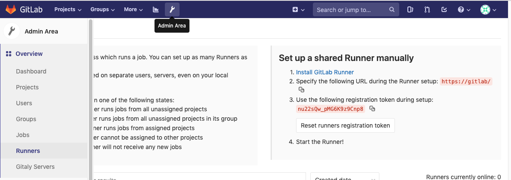
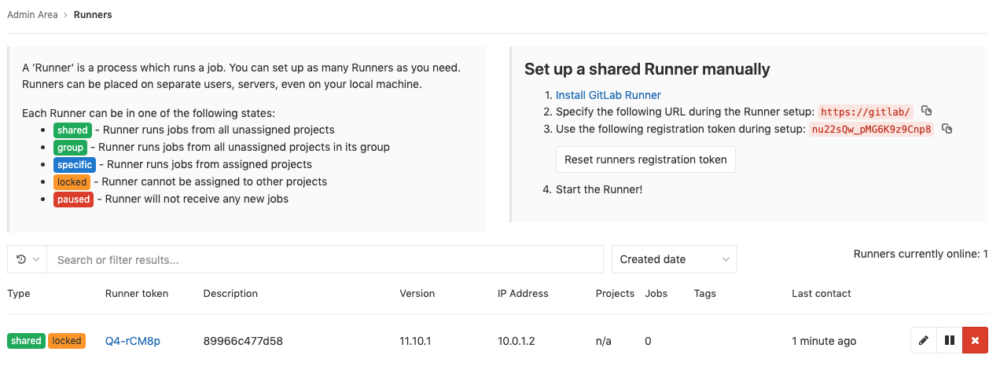

# GitLab
This dockerapp spins up a GitLab Instance with Container Registry and a global runner.

## Start Instance
```
$ docker-app deploy gitlab
Creating service gitlab_server
Creating service gitlab_cert
Creating service gitlab_runner
$
```

## Update Shared Runner Token

Once the gitlab instance is up, set a password, log in and head to the `Admin -> Runners` page to copy the registration token.



```
$ docker-app deploy gitlab -gitlab.runner.token=nu22sQw_pMG6K9z9Cnp8
Updating service gitlab_cert (id: p8xjxddn2vwzf74muo6unlxqh)
Updating service gitlab_gitlab (id: of8mryihynoi7i9ge8t60pstx)
Updating service gitlab_runner (id: 6y2g84h6newlutl1dxopcaxhy)
$
```
Once the runner service restarted, shared runner are available.


